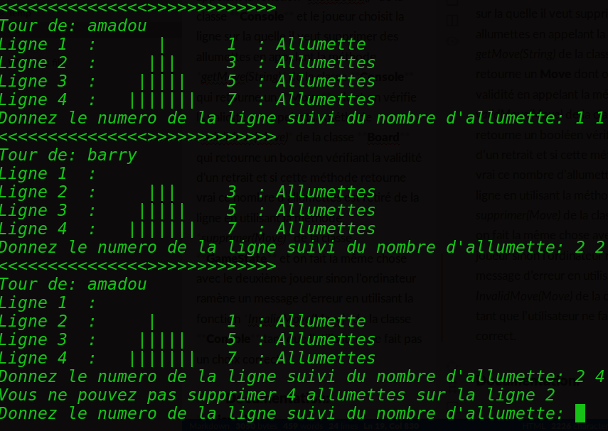


## Release 1:
Le jeu de **nim** est un jeu à deux joueurs qui consiste à retirer des allumettes dans une pyramide de façon a ce que celui qui retire la dernière allumette soit le perdant.
Cette version du jeu permet a deux joueurs humains de s'affronter en choisissant le nombre de lignes de leur pyramide et à chaque tour chaque joueur doit retirer au moins une allumette et au plus trois allumettes jusqu'à ce qu'il ne reste qu'une une seule allumette et affiche un message donnant le nom du gagnant de la partie.  **(voir image ci dessous)**

### Principales classes:
* **Console:** permet d'interagir avec l'utilisateur
* **Board:** représente le plateau de jeu et réunit les différents éléments d’un jeu :
les joueurs et l’état courant
* **Move:** représente un coup (une ligne et un nombre d’allumettes)
* **HumanPlayer:** représente un joueur humain
* **GameState:** représente l’état courant du jeu
* **GameStateTest:** effectue les tests unitaires pour la classe **GameState**
* **BoardTest:** effectue les tests des méthodes de la classe **Board**

### Principes du jeu:
Pour commencer une partie de nim à deux joueurs il faut saisir le nombre de lignes de la pyramide, cette tache est effectuée par la fonction *getSize()* de la classe **Console** , elle veille à ce que l'entier saisi soit toujours supérieur à 1.  **(voir image ci dessous)**

Après avoir saisi le nombre de lignes du plateau l'ordinateur demande à ce que chacun des joueurs saisisse son nom en se servant de la méthode *askName(int)* de la classe **Console** qui récupère une chaîne de caractère et crée un joueur humain en se servant du constructeur de la classe **HumanPlayer**.  **(voir image ci dessous)**

Une fois toutes ces informations recueillies l'ordinateur  fait jouer les joueurs en appelant la méthode jouerTour() de la classe **Board** qui fait jouer les joueurs jusqu'à ce qu'il ne reste qu’une seule allumette puis appelle la fonction *showWinner()* de la classe **Console** pour afficher le nom du gagnant.
Pour chaque tour le premier  joueur joue , la pyramide du jeu s'affiche par appel de la fonction *showBoard()* de la classe **Console** et le joueur choisit la ligne sur la quelle il veut supprimer des allumettes en appelant la méthode *getMove(String)* de la classe **Console** qui retourne un **Move**   dont on vérifie la validité en appelant la méthode *validMove(Move)* de la classe **Board** qui retourne un booléen vérifiant la validité d'un retrait et si cette méthode retourne vrai ce nombre d’allumettes est retiré de la ligne en utilisant la méthode *supprimer(Move)* de la classe **GameState** et on fait la même chose avec le deuxième joueur sinon l'ordinateur affiche un message d'erreur en utilisant la fonction *InvalidMove(Move)* de la classe **Console** tant que l'utilisateur ne fait pas un choix correct.

### Documentation:
* [**javadoc**](https://openclassrooms.com/courses/presentation-de-la-javadoc)
 * [**junit**](https://openclassrooms.com/courses/les-tests-unitaires-en-java)
* [**markdown**](https://fr.wikipedia.org/wiki/Markdown)
