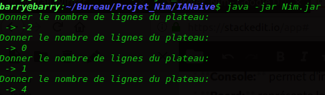
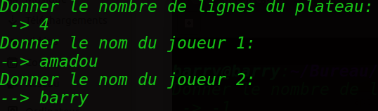
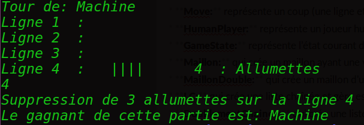
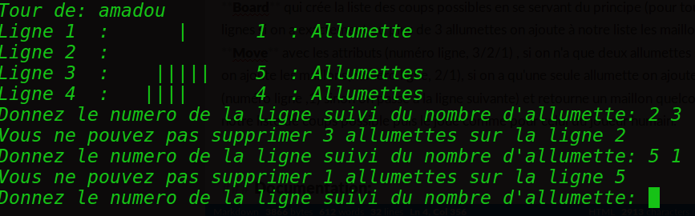


## Release 2:
Le jeu de **nim** est un jeu à deux joueurs qui consiste à retirer des allumettes dans une pyramide de façon a ce que celui qui retire la dernière allumette soit le perdant.
Cette version du jeu permet a un joueur humains de jouer contre une intelligence artificielle naïve en choisissant le nombre de lignes de leur pyramide et à chaque tour chaque joueur (Humain et IA) doit retirer au moins une allumette et au plus trois allumettes jusqu'à ce qu'il ne reste qu'une une seule allumette et affiche un message donnant le nom du gagnant de la partie. 
### Principales classes:
* **Console:** permet d'interagir avec l'utilisateur
* **Board:** représente le plateau de jeu et réunit les différents éléments d’un jeu :
les joueurs et l’état courant
* **Move:** représente un coup (une ligne et un nombre d’allumettes)
* **HumanPlayer:** représente un joueur humain
* **GameState:** représente l’état courant du jeu
* **Maillon:** qui crée un maillon ayant une valeur et l'adresse de son suivant
* **LC:** qui crée une liste chaînée et gère ses propriétés
* **GameStateTest:** effectue les tests unitaires pour la classe **GameState**
* **BoardTest:** effectue les tests des méthodes de la classe **Board**

### Principes du jeu:
Pour commencer une partie de nim contre une IA naïve il faut saisir le nombre de lignes de la pyramide de jeu , cette tache est effectuée par la fonction *getSize()* de la classe **Console** , elle veille à ce que le nombre saisi soit toujours supérieur à 1. **(voir image ci-dessous)**

Après avoir saisi le nombre de lignes du plateau l'ordinateur demande à ce que le joueur humain saisisse son nom en se servant de la méthode *askName()* de la classe **Console** qui récupère une chaîne de caractère et crée un joueur humain en se servant du constructeur de la classe **HumanPlayer**. **(voir image ci-dessous)**

Une fois toutes ces informations recueillies l'ordinateur commence a faire jouer en appelant la méthode jouerTour() de la classe **Board** qui fait jouer les joueurs  jusqu'à ce qu'il ne reste qu’une seule allumette puis appelle la fonction *showWinner()* de la classe **Console** pour afficher le nom du gagnant. **(voir image ci-dessous)**

Pour chaque tour on fait jouer le  joueur humain on affiche la pyramide du jeu en appelant la fonction *showBoard()* de la classe **Console** et le joueur choisit la ligne sur la quelle il veut supprimer des allumettes en appelant la méthode *getMove(String)* de la classe **Console** qui retourne un **Move** dont la validité est vérifiée en appelant la méthode *validMove(Move)* de la classe **Board** qui retourne un booléen vérifiant la validité d'un retrait et si cette méthode retourne vrai ce nombre d’allumettes est retiré de la ligne en utilisant la méthode *supprimer(Move)* de la classe **GameState** et c'est au tour de l'IA de jouer en utilisant une méthode qui est expliquée ci-dessous  sinon l'ordinateur affiche un message d'erreur en utilisant la fonction *InvalidMove(Move)* de la classe **Console** tant que l'utilisateur ne fait pas un choix correct. **(image coup invalide)**

Pour l'IA le choix du coup à jouer se fait par appel de la méthode *selectMoveMachine()* de la classe **Board** qui crée la liste des coups possibles en utilisant le principe (pour toutes les lignes si il y a exactement ou plus de 3 allumettes les maillons de type **Move** avec les attributs (numéro ligne, 3/2/1) seront ajoutés à la liste , si il n'y a que deux allumettes sur la ligne  les maillons(numéro ligne, 2/1) seront ajoutés à la liste, si il n'y a qu'une seule allumette le maillon (numéro ligne ,1) sera ajouté sinon elle passe à la ligne suivante). Après avoir construit la liste des coups possible l'IA prend un maillon quelconque de cette liste et joue ce coup comme le joueur humain. **(Tour de jeu)**
 

### Documentation:
* [**javadoc**](https://openclassrooms.com/courses/presentation-de-la-javadoc)
 * [**junit**](https://openclassrooms.com/courses/les-tests-unitaires-en-java)
* [**markdown**](https://fr.wikipedia.org/wiki/Markdown)

